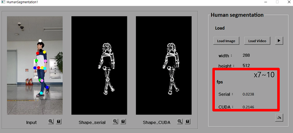

# Human-Segmentation
Human segmentation using Multi-frame

## Introduction
We use background subtraction using average filtering and Sobel filtering on the joint. And also we speed up the algorithm using CUDA.

## Filtering
### Average filtering
We use average filtering to denoise the input. And we increase the count when the difference between target frame pixel and each frame pixel is under a specific threshold. If the count value is over the specific threshold, we set a value on the background mask.

### Block and Sobel filtering
We find the maximum and minimum value of x, y coordinates based on joints. And we estimate edge using the Sobel filtering.

### Joint based range segmentation
We find a foot of the perpendicular from skeletons. And we set the body area in a specific range from the foot of perpendicular.
* Face : Circumference with a diameter of neck and crown.
* Body : Compare the distance between the neck and the crown and the distance between the shoulders to select a larger distance.
* Arms&Legs : Specify 1/4  of the distance between the hand and the elbow and between the heel and the foot.

## Results
### GUI-QT

## Prerequisites
* C++
* OpenCV
* CUDA
* QT
